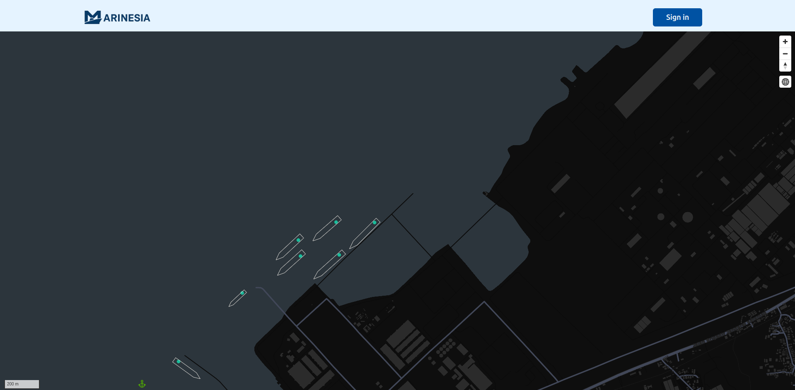

# Changelog
All notable changes to this project will be documented in this file.

## 2025-11-25
- Draw Vessel Outline Geometry on Coverage Map
- Added a (bow), b (stern), c (port), d (starboard) fields to the response of `/api/v1/vessel/nearby`. See https://api.marinesia.com/swagger#/vessel/vessel-get_vessel_nearby

  

## 2025-11-23
- Allowed name filter for vessel profile list API. See https://api.marinesia.com/swagger#/vessel/vessel-get_vessel_profiles
- eta (Expected Time of Arrival) and dest (Destination) fields. See https://docs.marinesia.com/features/#vessel-location
- Rate Limit page in Documentation. See https://docs.marinesia.com/rate-limit

