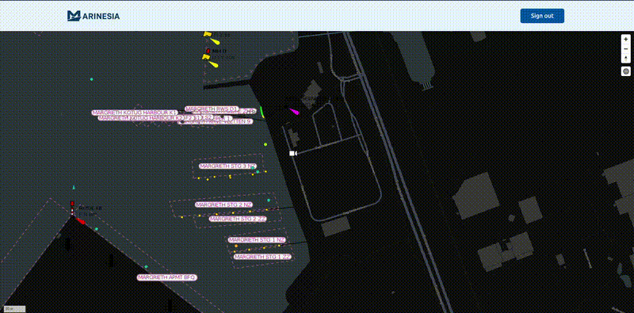
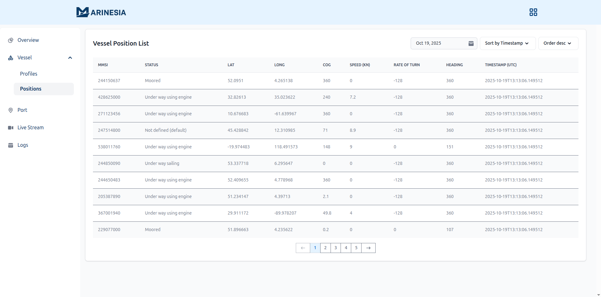
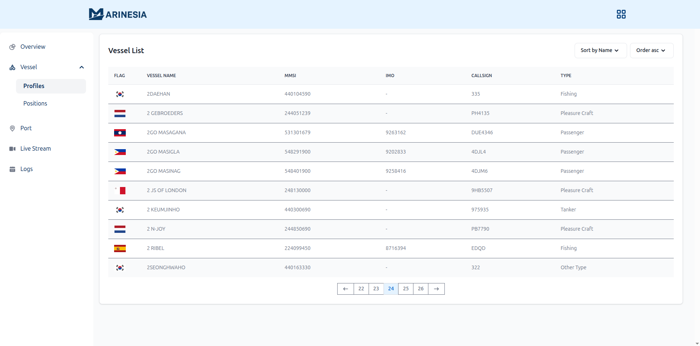
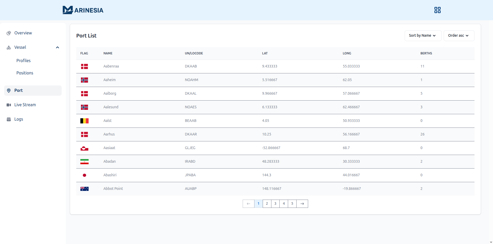

<p align="left">
  <a href="https://git.io/typing-svg">
    
  </a>
</p>

[](https://git.io/typing-svg)

[](https://github.com/syauqisabili/marinesia/commits/master/) [](https://marinesia.com) [](https://github.com/syauqisabili/marinesia/issues)

# Marinesia - Marine API

**Marinesia** is a free-to-use, lightweight and modern API designed for maritime applications. It provides APIs that support real-time vessel tracking, historical movements, ship profile management, global port registry, and location-aware CCTV live streams.

<p align="left">
  
</p>


<p align="left">
  <b>Portal:</b> <a href="https://marinesia.com">https://marinesia.com</a><br/>
  <b>Documentation:</b> <a href="https://docs.marinesia.com">https://docs.marinesia.com</a><br/>
  <b>Coverage:</b> <a href="https://marinesia.com/coverage">https://marinesia.com/coverage</a>
  
</p>

## Changelog
All updates and improvements to Marinesia are documented in the project’s changelog.
You can view the complete change history here: [CHANGELOG.md](CHANGELOG.md)

## Features

- Vessel location (AIS)
- Vessel profile with image
- Global port directory
- Live CCTV streaming from onboard locations (temporarily unavailable) 

## Getting started

#### Get Latest Vessel Location by MMSI

```http
  GET https://api.marinesia.com/api/v1/vessel/${MMSI}/profile?key=${YOUR_API_KEY}
```

| Parameter | Type     | Description                |
| :-------- | :------- | :------------------------- |
| `MMSI` | `string` | **Required**. MMSI (Maritime Mobile Service Identity) |
| `YOUR_API_KEY` | `string` | **Required**. Your API key |


## Dashboard — Vessel Position/Location (AIS)



### 🛰️ Overview
**Marinesia Vessel Position** enables users to monitor global vessel movements in real time using **Automatic Identification System (AIS)** data. Each vessel entry displays detailed navigation information.
This page provides both tabular and map-based vessel data views integrated into the **Marinesia Dashboard**.
- Browse live AIS vessel records in real time  
- Sort and filter by **MMSI**, **timestamp**, **speed**, or **heading**  
- *Filter by MMSI — Soon*

## Dashboard — Vessel Profile



### 🚢 Overview
**Marinesia Vessel Profile** provides detailed background information for each vessel detected in the **Marinesia AIS** ecosystem.  
Users can view complete vessel data including **MMSI**, **IMO**, **callsign**, **flag**, and **type**, all sourced from verified global maritime databases.
This page integrates seamlessly with the **Vessel Position** module — allowing users to access full vessel details directly from live AIS position records.
- View detailed vessel identity, type, and specifications  
- Access **flag**, **MMSI**, **IMO**, and **callsign**
- Filter and search vessels by name or MMSI  
- *Click a vessel to open its **real-time position view** — Soon* 
- *Vessel image & history — Soon*  


## Dashboard — Port



### ⚓ Overview
**Marinesia Port** feature provides a comprehensive list of global maritime ports with essential attributes such as country flag, UN/LOCODE, and berth information.
This module allows users to browse and analyze port data interactively within the Marinesia Dashboard.
- Browse port registry
- View country flags and UN/LOCODE identifiers
- Sort by name, country, UN/LOCODE, or berths
- *Search and filter by country — Soon*


## Dashboard — Live Stream


### 🎥 Overview
**Marinesia Live Stream** allows users to monitor maritime video feeds in real-time from various global locations — ports, canals, and open-water areas.   
This map uses **MapLibre GL JS** to visualize camera locations with distinctive camera markers.
- Zoom and pan to explore map areas  
- Hover or click on a camera to see details  
- *Camera list panel - Soon*
- *Open live video feeds directly — Soon*


## Give a Star 🌟
You can give this repository a star to show more people :)


## Support and Feedback

- Support: https://buymeacoffee.com/syauqisabili
- Feedback: contact@marinesia.com
