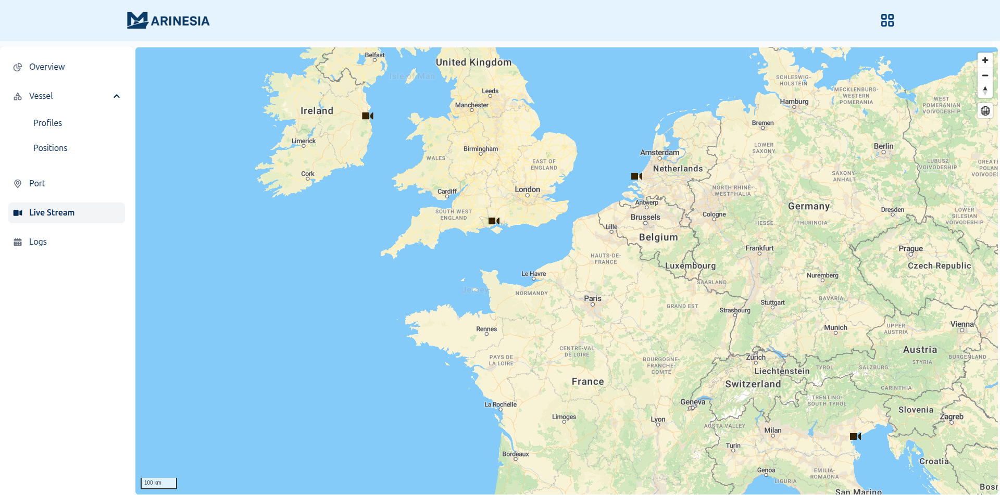

# Dashboard — Live Stream

## 🎥 Overview
**Marinesia Live Stream** allows users to monitor maritime video feeds in real-time from various global locations — ports, canals, and open-water areas.   
This map uses **MapLibre GL JS** to visualize camera locations with distinctive camera markers.
- Zoom and pan to explore map areas  
- Hover or click on a camera to see details  
- *Camera list panel - Soon*
- *Open live video feeds directly — Soon*
