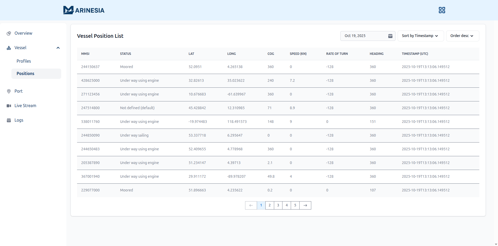

# Dashboard — Vessel Position/Location (AIS)

## 🛰️ Overview
**Marinesia Vessel Position** enables users to monitor global vessel movements in real time using **Automatic Identification System (AIS)** data. Each vessel entry displays detailed navigation information.
This page provides both tabular and map-based vessel data views integrated into the **Marinesia Portal**.
- Browse live AIS vessel records in real time  
- Sort and filter by **MMSI**, **timestamp**, **speed**, or **heading**  
- *Filter by MMSI — Soon*