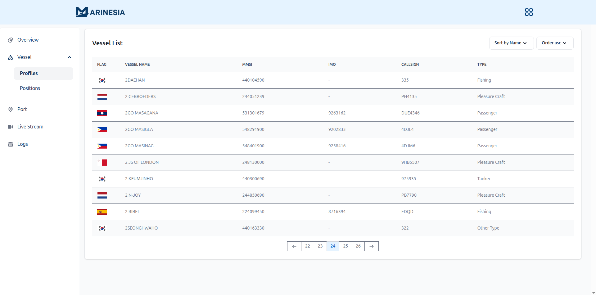

# Dashboard — Vessel Profile

## 🚢 Overview
**Marinesia Vessel Profile** provides detailed background information for each vessel detected in the **Marinesia AIS** ecosystem.  
Users can view complete vessel data including **MMSI**, **IMO**, **callsign**, **flag**, and**type**, all sourced from verified global maritime databases.
This page integrates seamlessly with the **Vessel Position** module — allowing users to access full vessel details directly from live AIS position records.
- View detailed vessel identity, type, and specifications  
- Access **flag**, **MMSI**, **IMO**, and **callsign**
- Filter and search vessels by name or MMSI  
- *Click a vessel to open its **real-time position view** — Soon* 
- *Vessel image & history — Soon*  
